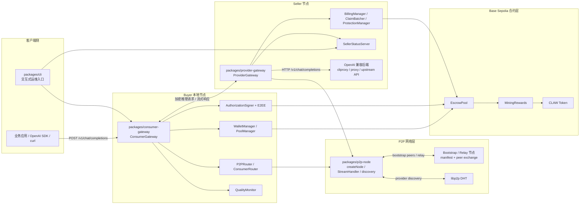
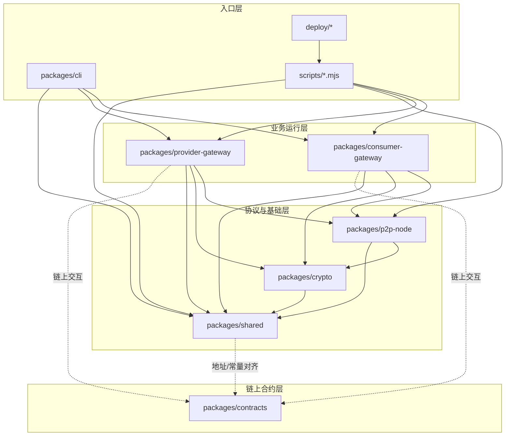

# 当前架构与模块关系

本文基于仓库 2026-04-21 的源码状态整理，目标是回答两件事：

- 当前系统运行时由哪些角色和层次组成
- 各个模块/包之间的依赖与职责边界是什么

相关运行手册可配合阅读：

- [Base Sepolia Marketplace Runbook](./testnet-marketplace.md)
- [Public Network Deployment](./public-network-deployment.md)

## 1. 当前架构图

### 架构解读

- 对外真正暴露给买方应用的是 `packages/consumer-gateway`，它在本机提供 OpenAI 兼容 HTTP 接口。
- 买卖双方的数据面走 `packages/p2p-node` 封装的 libp2p 网络，而不是中心化 API 网关。
- 卖方真正承接推理的是 `packages/provider-gateway`，它把 P2P 请求转发到任意 OpenAI 兼容后端。
- 结算信任根在链上 `EscrowPool`，不是数据库；卖方本地只是做授权校验、排队、批量 claim。
- bootstrap/relay 节点只负责网络入口、连通性和 peer 列表传播，不承载订单或计费状态。

## 2. 模块关系图

### 模块职责

| 模块 | 作用 | 关键内容 |
| --- | --- | --- |
| `packages/shared` | 全仓公共协议层 | 协议 ID、默认链配置、合约地址、共享 types |
| `packages/crypto` | 密码学能力层 | EIP-712 授权签名/验签、E2EE 加解密 |
| `packages/p2p-node` | 网络抽象层 | libp2p 节点创建、bootstrap/relay、DHT 发现、provider discovery、流式协议收发 |
| `packages/consumer-gateway` | 买方本地网关 | OpenAI 兼容接口、路由选卖家、签支付授权、加密请求、聚合响应、钱包/托管池操作 |
| `packages/provider-gateway` | 卖方 sidecar | 收 P2P 请求、验授权、转发上游、流式回传、队列化 claim、并发/日限额保护 |
| `packages/cli` | 本地运维入口 | 聚合买方状态、卖方状态、聊天、flush claim、doctor/init 等交互 |
| `packages/contracts` | 协议结算与激励 | `EscrowPool`、`MiningRewards`、`ClawToken`、Foundry 部署脚本 |
| `scripts/` | 环境装配层 | buyer/seller/bootstrap 启动器、bootstrap 维护、后端解析、嵌入 cliproxy |
| `deploy/` | 部署模板层 | env 示例、systemd 模板 |

## 3. 关键调用链

### 3.1 推理请求主链路

1. 应用请求 buyer 本地 `ConsumerGateway` 的 `/v1/chat/completions`。
2. `ConsumerGateway` 通过 `P2PRouter -> ConsumerRouter` 从 DHT/已连接 peers 中选择卖家。
3. buyer 侧用 `AuthorizationSigner` 生成本次结算授权，并用 `packages/crypto` 做 E2EE 加密。
4. `StreamHandler` 通过 `/clawmarket/inference/...` 协议把请求发送给 seller。
5. `ProviderGateway` 校验授权、检查并发/日额度保护，再把请求转发到真实上游后端。
6. 上游返回普通响应或 SSE 流后，seller 逐段加密，通过 P2P stream 回传给 buyer。
7. buyer 解密响应，必要时转成 OpenAI 兼容的流式输出，并记录 `QualityMonitor` 指标。

### 3.2 结算主链路

1. buyer 资金先通过 `PoolManager` 充值到 `EscrowPool`。
2. 每次请求携带的 `SignedAuthorization` 只授权 seller 未来 claim 指定额度。
3. seller 收到并验证授权后，不立即改链上状态，而是先进入 `BillingManager` / `ClaimBatcher` 队列。
4. `ClaimBatcher` 定时或达到批量阈值后调用 `EscrowPool.claim(...)`。
5. `EscrowPool` 校验签名、nonce、余额、过期时间后，把 buyer 托管资金结算给 seller，并抽取协议费。
6. `EscrowPool` 在 claim 成功时调用 `MiningRewards.recordSettlement(...)`，给 seller 发放对应的 CLAW 激励。

## 4. 当前架构的边界与特点

- 当前没有中心化 registry、订单库或调度服务，provider 发现依赖 libp2p DHT、bootstrap manifest、peer exchange，以及已建立连接上的 direct discovery。
- buyer 和 seller 都是“本地网关 + 本地节点”模式；也就是说，应用层入口和协议节点是部署在同一角色机器上的。
- `packages/provider-gateway` 不关心具体模型厂商，只要求上游兼容 `/v1/chat/completions`。
- `packages/contracts` 与 TS 运行时是“地址/ABI/签名规则耦合”，不是直接代码依赖；运行时通过常量、ABI 和链上调用完成对接。
- `SellerStatusServer`、`packages/cli`、`scripts/` 属于运维与落地层，不是协议最小闭环的一部分，但对当前 testnet 交付非常关键。
- 当前网络层特意把 `AutoNAT` 设计成显式开启项；默认关闭，以避免探测行为打断业务流。

## 5. 建议后续维护方式

- 后续如果新增 package，优先更新上面的“模块关系图”和“模块职责”表，而不是只补运行文档。
- 如果 buyer/seller 角色拆成独立服务，建议把本文的“当前架构图”拆成“控制面 / 数据面 / 结算面”三张图。
- 如果链上合约地址、claim 机制或 provider discovery 机制变化，本文应与 `docs/testnet-marketplace.md` 一起同步。
