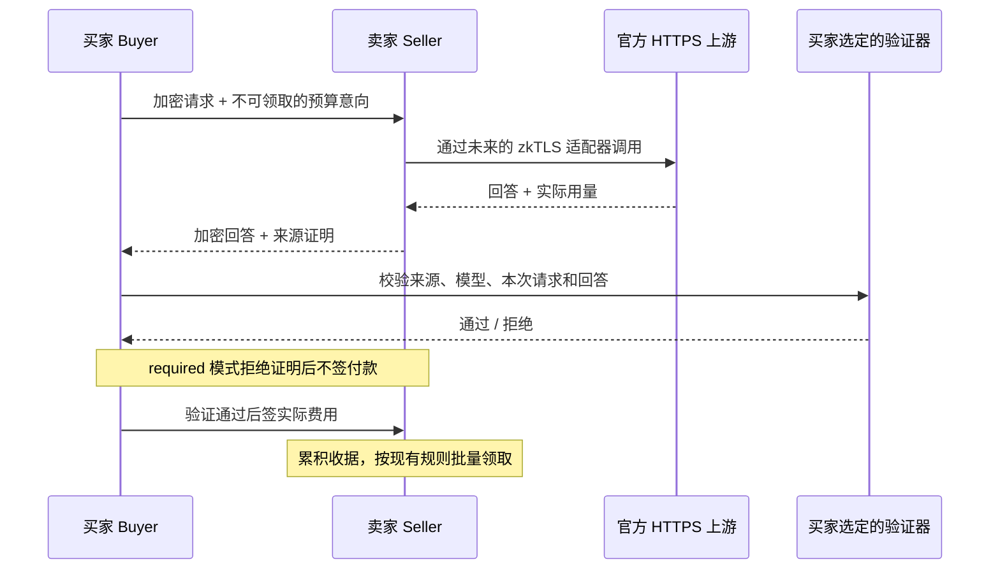

# 模型来源验证 / Model provenance adapters

TAM 已预留 zkTLS 的接入接口，尚未实现或启用真正的 zkTLS。当前公网和本机默认仍是 `off`，模型来源由卖家声明。测试里的 `test-only` 只是模拟适配器，不能用于认证。

## 一句话原理

以后卖家调用官方服务时，同时生成一份脱敏的来源证明；买家先验证这份证明确实对应自己这次收到的回答，再签付款。证明在链下验证，现有结算合约不需要为每次回答增加一笔验证交易。



## 已有接口

| 位置 | 接入点 | 用途 |
| --- | --- | --- |
| `@clawmarket/shared` | `ProviderInferenceBackend` | 卖家可替换的上游传输器，输出文本片段，最后输出用量和证明 |
| `@clawmarket/shared` | `ModelProvenanceVerifier` | 买家选定的独立验证器，验证成功才返回官方来源和模型 |
| `@clawmarket/shared` | `ModelProvenanceProof` | 带版本、方案名称、绑定信息和脱敏证据的 JSON 信封 |
| `@clawmarket/crypto` | `modelProvenanceRequestBinding` / `ModelProvenanceTextDigest` | 生成请求上下文和回答摘要 |
| `ProviderGateway` | 第三个构造参数 `inferenceBackend` | 注入真正拥有官方连接的生成证明适配器 |
| `ConsumerGateway` | `ConsumerConfig.modelProvenance` + `options.modelProvenanceVerifier` | 在最终签付款之前检查证明 |
| TypeScript `TAM` SDK | 配置中的 `modelProvenance` / `modelProvenanceVerifier` | Hosted 调用也在买家本地验证之后才签付款 |
| P2P / Hosted | `modelProvenanceProof` | 传递证据；Hosted 不替买家授予认证状态 |

旧 `upstreamProof` 仅保留为卖家报告的请求标识、模型和用量，不属于密码学证明。新增 `tamProvenance` 来自本机买家或 TypeScript SDK 的校验结果；卖家传来的 `verified: true` 不会被接受为认证依据。

## 买家的三种策略

| 策略 | 无证明 | 有证明 |
| --- | --- | --- |
| `off`（默认） | 按现有流程调用和结算 | 不认证，结果为 `unverified / disabled` |
| `optional` | 可调用和结算，明确标记未验证 | 有验证器时验证，错误证明拒绝付款；无验证器时仅检查信封绑定，仍未验证 |
| `required` | 拒绝付款 | 必须通过买家选择的验证器、来源白名单和模型检查 |

`required` 没有验证器时在启动/构造阶段直接报错，不会静默退回 `off`。带验证器的 `optional` 和 `required` 必须配置 HTTPS 来源白名单。证明校验失败不自动换卖家再次调用。流式文本可先展示，成功结束事件在本机验证及收款确认之后发出。

构造参数示意（变量代表接入方提供的实际配置和经过审核的适配器）：

```ts
import { ProviderGateway } from '@clawmarket/provider-gateway';
import { ConsumerGateway } from '@clawmarket/consumer-gateway';

const seller = new ProviderGateway(providerConfig, undefined, {
  inferenceBackend: reviewedProverBackend,
});

const buyer = new ConsumerGateway({
  ...consumerConfig,
  modelProvenance: {
    mode: 'required',
    allowedOrigins: ['https://api.openai.com'],
    allowedSchemes: ['your-reviewed-adapter-v1'],
    verificationTimeoutMs: 10_000,
  },
}, router, wallet, streamHandler, undefined, {
  modelProvenanceVerifier: reviewedVerifier,
});
```

TypeScript SDK 接收相同策略和验证器。不要把 `reviewedVerifier` 换成固定返回成功的函数。现有 Python SDK 尚未提供证明验证器入口，保持原有信任模式；要求来源验证的 Hosted 调用目前应使用 TypeScript SDK。CLI 未开放“已认证”开关，也没有自动加载外部模块的入口。

## 证明绑定规则

`binding` 必须匹配买家本地计算的完整上下文：

- 请求 ID、加密请求的 `payloadHash`、模型、买卖双方、链 ID、结算池、nonce 和有效期。
- `intentHash`：不含签名的预算意向的 SHA-256，包含锁定价格、额度、输入/输出上限和 nonce 模式；整数金额转换成十进制字符串。
- `requestHash`：TAM 请求的规范化 JSON 的 SHA-256；对象键按字符排序，数组顺序不变；`stream` 统一为 `true`，缺省 `max_tokens` 为 1024。
- `responseHash`：按交付顺序拼接的完整 assistant 文本的 UTF-8 SHA-256；摘要器兼容 emoji 被切在不同片段的情况。
- `usage`：该回答的输入、输出和总 Token 数；费用仍受原签名预算约束。

统一使用 `0x` 开头的摘要。钱包和池标识转成小写，nonce 为十进制字符串。证明 JSON 最大 256 KiB，验证默认限时 10 秒并提供 AbortSignal。凭据、Cookie、API Key 和原始认证头不能放在 `evidence` 中。

当前卖家的交付确认等待为 15 秒，Hosted 等待为 12 秒。实际接入时，买家验证耗时需要留在这些等待预算内；调大 `verificationTimeoutMs` 本身不会延长它们。如果验证更慢，需要同时调整交付确认时限并验证断线取消行为。当前摘要范围为单条 assistant 文本；工具调用、多模态内容和多候选回答需要另行定义并审核摘要格式。

## 真正的适配器还要实现什么

外层字段相等只说明“这份声明对得上”，不证明官方真的发送过回答。验证器必须验证证据里的 HTTPS 来源、信任根/见证方、请求方法与路径、请求和完整回答及用量，并将它们与 `expected` 绑定。必须使用不可伪造的会话或见证挑战绑定本次 nonce 和有效期；不能只把旧 HTTPS 证明贴到一份新的 JSON 信封上。

请求模型名来自买家输入，不能作为“官方模型”的证明。验证器返回的模型必须来自已认证的官方证据；存在官方版本别名时，由买家显式配置 `modelAliases`，不接受卖家自行放宽匹配。

当前卖家经过本地 CLIProxyAPI 转发。对 `127.0.0.1` 的证明无法认证模型公司，因此未来适配器要控制实际官方 HTTPS 会话。若上游请求因代理而发生模型映射、系统指令注入或 SSE 格式转换，必须验证转换与原 TAM 请求/最终交付的一致性，不能简单比较两个不同格式的 JSON 摘要。

TLSNotary、Reclaim 等具体供应商尚未选定，也没有新增依赖、见证服务器或供应商密钥。选择时应检查实际流式能力、认证头隐藏、证据容量、生成耗时、验证信任模型和许可证。来源证明证明的是官方端点及其返回声明，无法观察官方内部实际运行的模型权重。可参考 [TLSNotary 的信任模型说明](https://tlsnotary.org/docs/faq/) 和 [Reclaim zk-fetch 官方代码](https://github.com/reclaimprotocol/zk-fetch)。

现有链下交付确认和链上批量收款保持兼容，BSC 测试网 USDC / BEM 两种结算都可使用这些接口。zkTLS 生成证明的服务费用和延迟需在选定适配器后测量；接口预留不表示证明免费。

## English

TAM now reserves proof generation and buyer-local verification interfaces. No real zkTLS implementation, provider credentials or production verifier is included. Default operation remains `off`; existing `upstreamProof` is seller-reported metadata.

Inject `ProviderInferenceBackend` into `ProviderGateway` to own the real upstream HTTPS transport and emit a redacted `modelProvenanceProof` with final usage. Inject `ModelProvenanceVerifier` into `ConsumerGateway` or the TypeScript SDK. `required` refuses collectible payment signatures for missing, mismatched, expired or invalid evidence; it refuses startup without a verifier. `optional` permits missing proofs while marking them unverified. Buyer-owned HTTPS origin and optional scheme/model-alias policies restrict accepted results.

Bindings cover the request, delivered answer, usage, unsigned intent (prices and budgets), buyer/seller, chain, pool, nonce and expiry. Envelope equality is not cryptographic authentication: the adapter must authenticate the official transcript and a fresh session challenge against the complete expected context. Proxy transformations must also be verified. Proofs are at most 256 KiB; verification has a default 10-second timeout and abort signal. Never include credentials in evidence. Python SDK and CLI adapter-loading support are future work. The existing escrow contracts and USDC/BEM settlement mechanics are unchanged.
